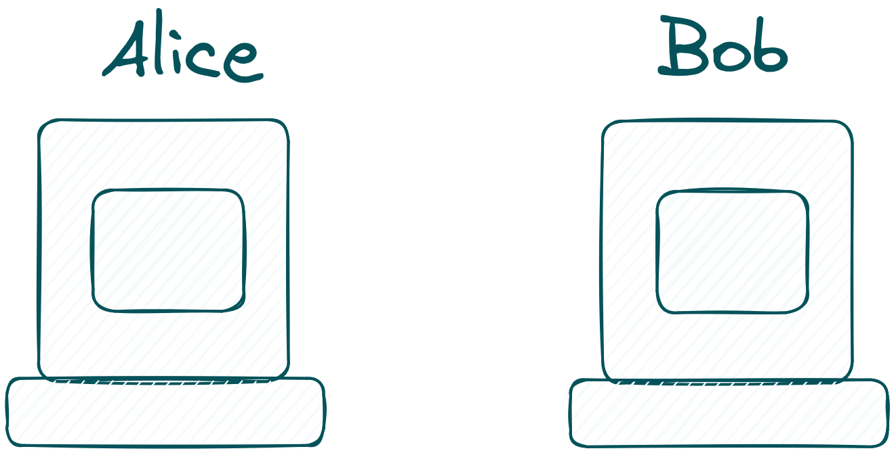
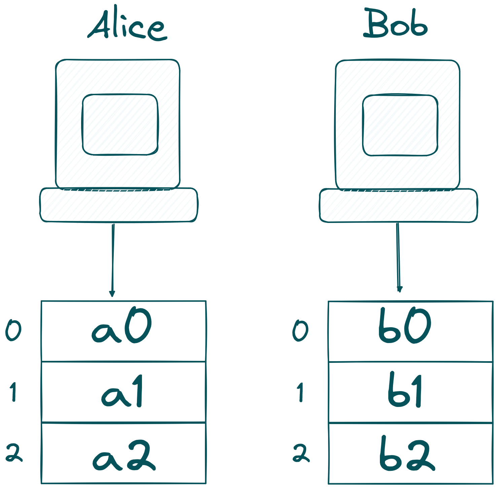

# Collaborative SNARKs Primer

**Collaborative SNARKs (coSNARKs)** are a recent innovation, [introducing in 2021](https://eprint.iacr.org/2021/1530.pdf), that merge the strengths of MPC and zkSNARKs. They allow multiple parties to collaboratively create a proof verifying the correctness of a computation while keeping their individual inputs private. This method addresses the challenge of computing on private shared data without needing a trusted third party. Each party participates in a distributed protocol that produces a single SNARK proof, confirming the accuracy of the combined computation without revealing any individual inputs. The resulting proof is succinct and can be efficiently verified by anyone, ensuring the integrity of the computation while safeguarding sensitive data.

To highlight what we can achieve with coSNARKs imagine two parties, Alice and Bob.

Alice and Bob own a secret value $a$ and $b$ respectively. They want to compute the [Poseidon](https://eprint.iacr.org/2019/458.pdf) hash of their combined secrets, but without revealing $a$ or $b$ to each other, while also producing a ZKP that their computation was correct and resulted in said public hash (a real use-case would also additionally prove properties about $a,b$).

Sure, they could send their secrets to a trusted third party to compute the hash and return the result. But then that third party would learn both of their secrets, which they’re not comfortable with. This is where coSNARKs come into play, allowing them to securely compute the hash together without exposing their private values.

First of all, Alice and Bob need to [secret-share](https://en.wikipedia.org/wiki/Secret_sharing) $a$ and $b$.

Remember, shares of a secret-shared value are safe to send around as one needs a certain threshold of shares to obtain the original secret. With that in mind, Alice and Bob send their shares to an MPC-network.

In our example, the MPC-network consists of three computing nodes. In a real-world example, Alice and Bob can also participate as one of the nodes, only Bob can participate, or neither Alice nor Bob joins! Zooming into the computing nodes, it looks like this:

The MPC network now computes the extended witness of $a$ and $b$. If you are confused what this means, we recommend reading the explanation in the [circom documentation](https://docs.circom.io/getting-started/computing-the-witness/)! TLDR: we compute the circuit with the inputs $a$ and $b$ and get the result of the circuit. In our case, this is the Poseidon hash of $a$ and $b$!

The last step is to compute the proof! Computing the proof can either be done by the same computing nodes as in the previous step, but they may differ in a real example.

The final result is the Poseidon hash of $a$ and $b$ and a coSNARK attesting the validity of the Poseidon hash!
